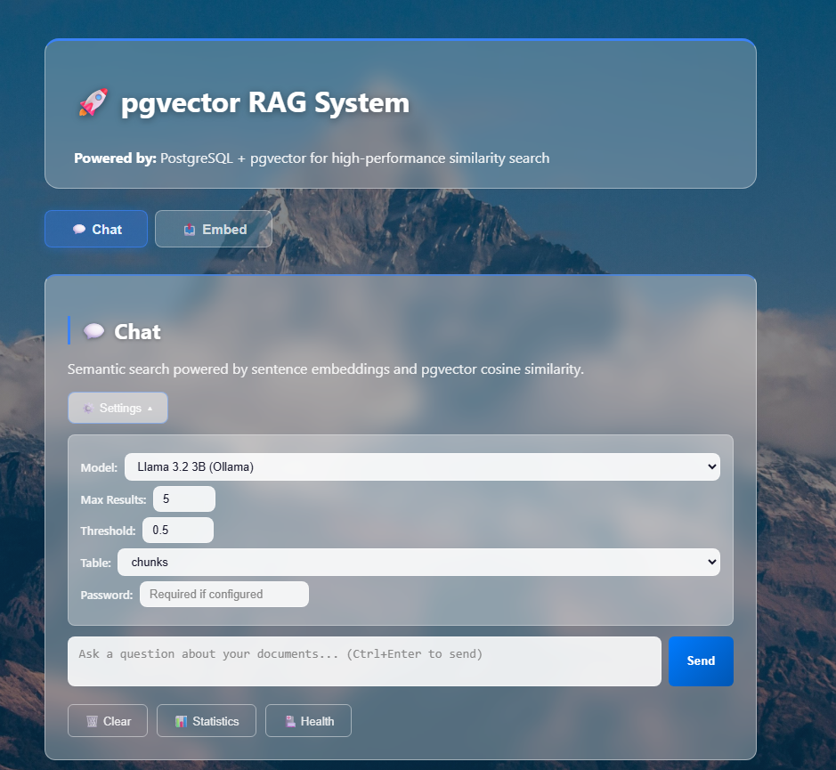
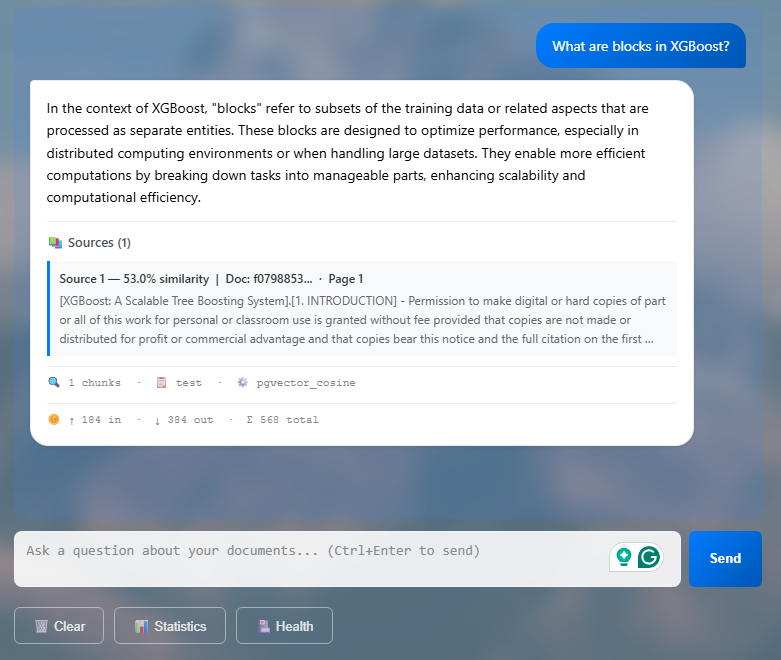
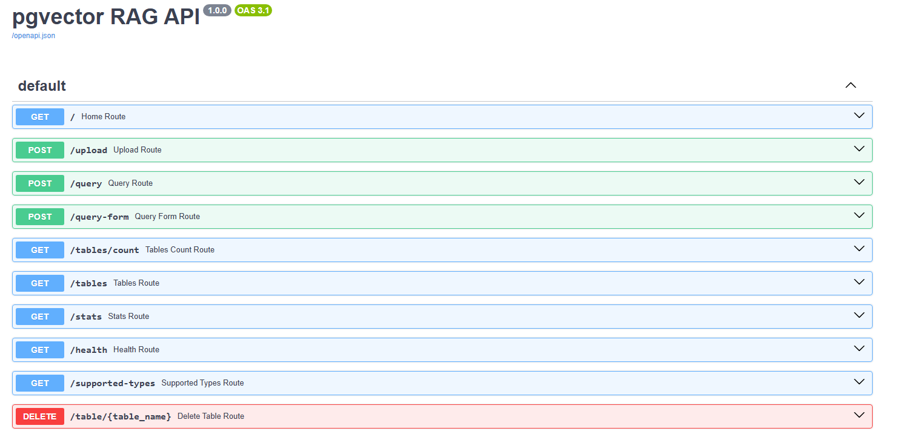
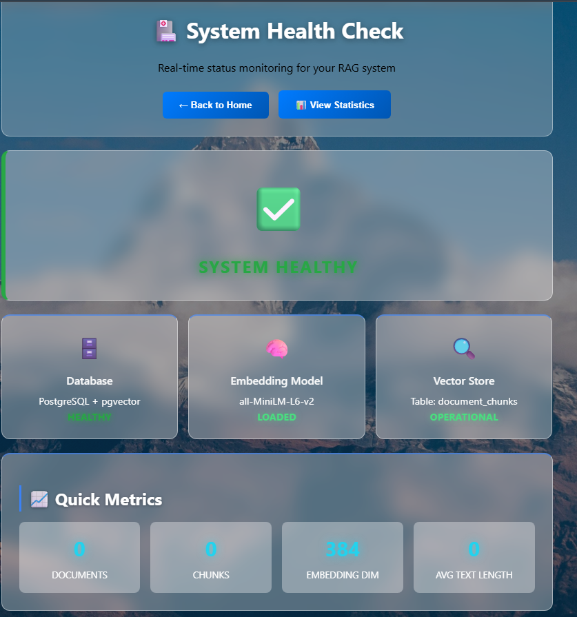
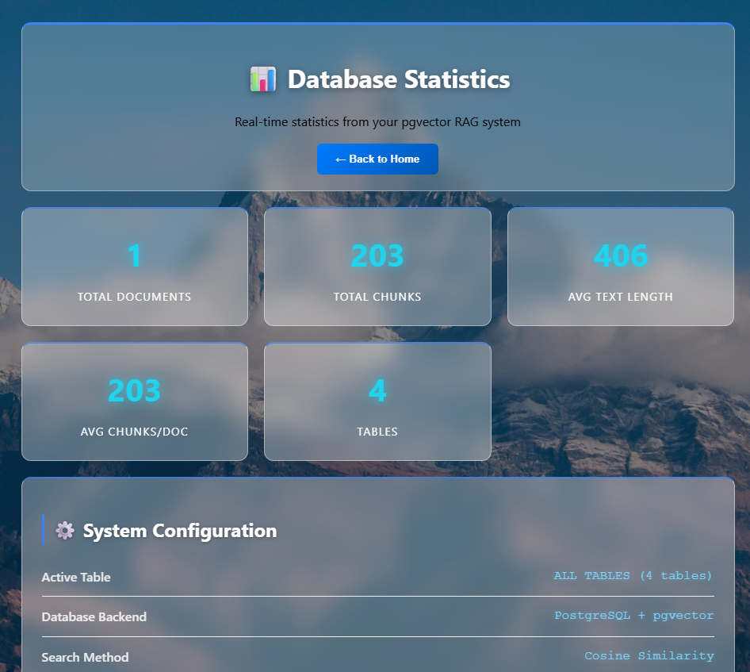
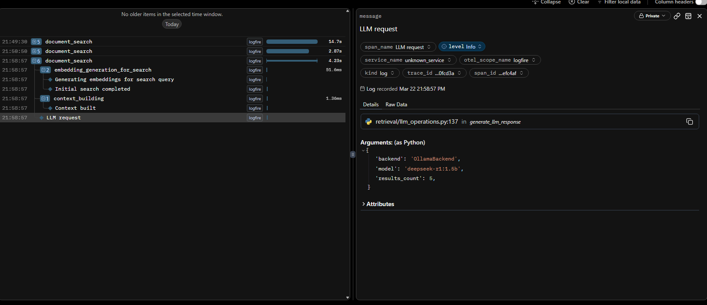

# RAG with pgvector

A Retrieval-Augmented Generation (RAG) system built with FastAPI, PostgreSQL + pgvector, and Chonkie for markdown-aware chunking. Upload documents, parse them into structured chunks with vision-language models, embed them, and query with hybrid search + reranking.

---

## Core Features

**Document Ingestion**
- Multi-format support: PDF, DOCX, TXT
- Two PDF parsing backends: Docling + Ollama VLM (local) or Docling + Gemini Vision (cloud)
- Stage-based pipeline with status tracking: `registered → parsing → parsed → chunking → chunked → embedding → embedded`
- Automatic retry on failure with configurable max attempts
- On-disk artifacts for inspection (`data/parsed/`, `data/chunks/`)

**Intelligent Chunking**
- Four strategies: markdown-aware (default), recursive, token, semantic
- Adaptive selection: automatically downgrades semantic chunking for large documents (>100KB)
- PDF-specific enrichment: page numbers, section paths, full-page context
- Six-stage text cleaning pipeline (Unicode normalization, math symbols, table structure preservation)

**Hybrid Search & Retrieval**
- Vector similarity search (pgvector, cosine distance)
- BM25 lexical search
- Reciprocal Rank Fusion (RRF) to merge results
- Optional cross-encoder reranking (top-k)
- Sibling expansion for structural queries (reconstructs split sections)

**LLM Answer Generation**
- Pluggable backends: Gemini (cloud) or Ollama (local)
- Multiple model support: Gemini 2.5 Flash, DeepSeek-R1, Llama 3.2, and others
- Token usage tracking and logging

**Web UI**
- Chat tab: ask questions, see source chunks with similarity scores and page numbers
- Embed tab: upload documents, choose parsing backend, track ingestion status
- Statistics and health check endpoints
- Swagger UI for interactive API exploration

**Infrastructure**
- Celery-based async processing with two queues: `upload` (interactive) and `ingestion` (batch)
- PostgreSQL + pgvector for chunk storage and similarity search
- Redis as Celery broker
- Docker Compose for local development
- Optional Langfuse integration for LLM observability

---

## Tech Stack

| Layer | Technology | Purpose |
|-------|-----------|---------|
| **Web Framework** | FastAPI | REST API + web UI |
| **Database** | PostgreSQL + pgvector | Chunk storage, vector similarity search |
| **Task Queue** | Celery + Redis | Async document processing |
| **Embedding** | SentenceTransformer (`all-MiniLM-L6-v2`, 384-dim) | Chunk vectorization |
| **Chunking** | Chonkie | Markdown-aware text splitting |
| **PDF Parsing** | Docling | Layout detection, table structure extraction |
| **Vision-Language Models** | Ollama (qwen3.5:0.8b) / Gemini Vision | Figure and complex table description |
| **LLM Backends** | Google Generative AI SDK / Ollama REST API | Answer generation |
| **Reranking** | Cross-encoder (`ms-marco-MiniLM-L-6-v2`) | Result refinement |
| **Configuration** | Pydantic Settings | Type-safe environment variable management |
| **Testing** | pytest + pytest-asyncio | Unit and integration tests |
| **Observability** | Logfire / Langfuse | Metrics, traces, LLM interaction logging |
| **Containerization** | Docker + Docker Compose | Local development environment |

---

## How It Works

```
Raw file  →  Status DB (documents)  →  Parse  →  Chunk  →  Embed  →  pgvector  →  Query + Rerank  →  LLM Answer
data/input/raw/   one row per file,           (parser)  (chunker) (vector)  (PostgreSQL)   (BM25)            • Gemini 2.5 Flash
             stage-based, claim & retry                                                             • DeepSeek-R1 8B
                                                                                                   • Llama 3.2 3B
```

1. **Upload / scan** - drop a file via the API or the weekly scan. The raw file is saved in `data/input/raw/` and a status row is inserted into the `documents` table (`stage = registered`).
2. **Parse** - a Celery worker claims the row, extracts text using the chosen backend (Docling + Ollama VLM, or Docling + Gemini Vision), and stores the parsed text in `document_parsed`.
3. **Chunk** - the parsed text is split into chunks; the result is stored in `document_chunked`.
4. **Embed** - each chunk is embedded with `all-MiniLM-L6-v2` and stored in the existing `chunks` pgvector table.
5. **Query** - a question triggers vector similarity search + BM25 reranking.
6. **Answer** - top chunks are passed to your chosen LLM: **Gemini 2.5 Flash** (cloud) or a **DeepSeek-R1 / Llama** model running locally via Ollama.

The status DB is coordinated by two Celery queues: `upload` (single worker for API uploads) and `ingestion` (scalable batch workers). A weekly scan registers new files and retries errors; a stale-claim sweep resets tasks stuck longer than `INGESTION_CLAIM_TIMEOUT_MINUTES`.

---

## Quick Start

### 1. Prerequisites

- [Docker Desktop](https://www.docker.com/products/docker-desktop) (8 GB+ RAM allocated)
- A [Google Gemini API key](https://makersuite.google.com/app/apikey) *(optional - only required for Gemini parsing or Gemini Q&A)*
- [Ollama](https://ollama.com) running locally *(optional - required for local LLM parsing and Q&A)*

### 2. Configure environment

```bash
cp .env.example .env
# Edit .env - minimum required:
#   GOOGLE_API_KEY=your-key-here
#   POSTGRES_PASSWORD=a-secure-password
```

### 3. Build and run

The Dockerfile uses a two-stage build. The first stage (`Dockerfile.base`) installs heavy ML dependencies and only needs to run once. Subsequent builds are fast.

```bash
# Step 1 - build the base image (first time only, ~8–10 min)
docker build -f deploy/deployment/Dockerfile.base -t rag-base:latest .

# Step 2 - build and start all services (~1–2 min)
docker compose --profile observability up --build
```

The app is ready when you see:
```
rag_app  | INFO:     Application startup complete.
```

Open **http://127.0.0.1:8000**

> **Windows users:** use `http://127.0.0.1:8000` (not `localhost`). Windows 11 resolves `localhost` to IPv6 (`::1`) but Docker only binds to IPv4, causing the browser to hang silently.

| URL | Description |
|-----|-------------|
| http://127.0.0.1:8000 | Web UI - Chat and Embed tabs |
| http://127.0.0.1:8000/stats | Database statistics |
| http://127.0.0.1:8000/health | System health check |
| http://127.0.0.1:8000/docs | **Swagger UI - interactive API docs** |
| http://127.0.0.1:8000/redoc | ReDoc - readable API reference |

> **Swagger UI** (`/docs`) lets you call every endpoint directly from the browser - no curl or Postman needed. Click an endpoint → **Try it out** → fill in params → **Execute**.

### 4. Stop services

```bash
docker compose down
```

---

## Repo Structure

```
rag_with_llama/
│
├── src/app/                      # All application code, one importable root
│   │
│   ├── ingestion/                # Document ingestion pipeline
│   │   ├── artifacts.py          # Writes data/parsed + data/chunks dumps
│   │   ├── processors/           # Parser per file type + Docling/Ollama/Gemini backends
│   │   │   ├── processor_factory.py  # Picks processor by file type
│   │   │   ├── pdf_parser_factory.py # Picks PDF backend (Ollama VLM vs Gemini)
│   │   │   ├── gemini_docling_parser.py  # Core PDF parser (batched convert + VLM pipeline)
│   │   │   ├── ollama_pdf_parser.py      # Ollama VLM subclass
│   │   │   ├── docx_processor.py
│   │   │   └── txt_processor.py
│   │   ├── chunking/
│   │   │   └── chunker_factory.py    # token / recursive / markdown / semantic
│   │   ├── embedding/            # Split by responsibility
│   │   │   ├── chunk.py           # Chunk dataclass
│   │   │   ├── generator.py       # EmbeddingGenerator (SentenceTransformer)
│   │   │   ├── vector_store.py    # VectorStore (pgvector data access)
│   │   │   └── pipeline.py        # ChunkEmbeddingPipeline (orchestration)
│   │   ├── extraction/           # Entity extraction flow (graph feature, unwired)
│   │   ├── text_cleaning/
│   │   │   └── cleaners.py       # Six-stage text cleaning pipeline
│   │   └── validation/
│   │       └── file_validator.py
│   │
│   ├── retrieval/
│   │   ├── search.py             # Vector search → BM25 rerank → LLM
│   │   ├── llm_operations.py     # LLM answer generation (Gemini or Ollama)
│   │   ├── reranking.py          # Cross-encoder reranker
│   │   └── utils.py              # BM25 scorer, RRF merge
│   │
│   ├── api/
│   │   ├── app.py                # FastAPI app, route registration
│   │   ├── validators.py
│   │   ├── renderer.py           # Jinja2 template renderer
│   │   ├── templates/            # HTML templates (Jinja2, autoescaped)
│   │   └── routes/
│   │       ├── document_routes.py    # Upload, status, delete document
│   │       ├── query_routes.py       # Home page, query / query-form
│   │       ├── table_routes.py       # List / count / delete tables
│   │       ├── domain_routes.py      # Domain registry CRUD
│   │       ├── admin_routes.py       # Stats, health check
│   │       ├── observability_routes.py  # LLM interaction stats/history
│   │       └── graph_routes.py       # Graph feature — NOT mounted
│   │
│   ├── graph/                    # Knowledge graph feature (unwired, see ARCHITECTURE.md §9.3)
│   │   ├── entity_extraction.py
│   │   ├── relationship_extraction.py
│   │   ├── graph_service.py
│   │   └── {gemini,ollama}_provider.py
│   │
│   ├── config/
│   │   ├── app_config.py         # AppConfig, AppSettings, DatabaseConfig
│   │   └── graph_config.py       # GraphConfig (graph feature)
│   │
│   ├── models/
│   │   ├── schemas.py            # Pydantic request/response models
│   │   └── graph_models.py       # Graph feature schemas
│   │
│   ├── worker/
│   │   ├── celery_app.py
│   │   └── ingestion_tasks.py    # Stage-based parse / chunk / embed tasks
│   │
│   └── infra/                    # Shared plumbing (used by 2+ layers)
│       ├── db/                   # Connection pool, repositories, identifiers
│       │   ├── pool.py
│       │   ├── identifiers.py    # validate_table_name, quote_ident
│       │   ├── table_repository.py
│       │   ├── domain_repository.py
│       │   └── ingestion_repository.py
│       └── telemetry/            # LLM interaction logger
│           └── llm_logger.py
│
├── data/                         # Runtime data (gitignored)
│   ├── input/                    # Original files from API uploads / weekly scan
│   │   └── raw/
│   ├── parsed/                   # <document_id>_<name>.md from the parse stage
│   └── chunks/                   # One folder per document from the chunk stage
│       └── <document_id>_<name>/
│           ├── 0000.md           # One file per chunk
│           └── index.json        # Per-chunk metadata
│
├── tests/
│   ├── unit/                     # No DB required
│   └── integration/              # Requires running postgres
│
├── deploy/
│   ├── deployment/
│   │   ├── Dockerfile            # App image (uses Dockerfile.base)
│   │   ├── Dockerfile.base       # Heavy ML deps (build once)
│   │   ├── Dockerfile.postgres   # Postgres + pgvector
│   │   ├── Dockerfile.test       # Test runner
│   │   ├── requirements.txt
│   │   └── Makefile              # Test + dev shortcuts
│   └── migrations/
│       ├── optional/            # Not applied by initdb (graph schema)
│       ├── 002_create_llm_interactions.sql
│       ├── 003_create_ingestion_status.sql
│       ├── 004_ingestion_fixes.sql
│       ├── 005_drop_filename_dedupe.sql
│       └── 006_domains_and_doc_name.sql
│
├── docs/                         # Developer documentation & design decisions
│   ├── ARCHITECTURE.md           # Read this first — full system architecture
│   ├── plans/                    # Feature plans and optimization strategies
│   ├── images/                   # Screenshots and README assets
│   └── archive/                  # Historical refactoring notes
│
├── experiments/                  # Scratch notebooks, kept as reference only
├── docker-compose.yml
├── pytest.ini
└── .env.example
```

Everything under `src/app/` imports as `app.*` — `from app.ingestion.embedding.pipeline import ChunkEmbeddingPipeline`. `pytest.ini` puts `src/` on the path locally; the Docker images set `PYTHONPATH=/app/src`.

---

## How to Navigate the Repo

**For a new feature:**
1. Read [`docs/ARCHITECTURE.md`](docs/ARCHITECTURE.md) first — it explains the system's purpose, data flow, directory layout, and critical design decisions.
2. Decide whether the feature touches ingestion, query, or admin/observability.
3. Look at the relevant route module in `src/app/api/routes/`.
4. Trace into the domain layer: `src/app/ingestion/`, `src/app/retrieval/`, or `src/app/infra/db/`.
5. If it runs in background, add tasks in `src/app/worker/ingestion_tasks.py` and update `celery_app.py` schedules/queues.
6. Add tests in `tests/unit/` (fast) or `tests/integration/` (requires Postgres).
7. Update `docs/ARCHITECTURE.md` if the architecture changes.

**For debugging:**
- Check `documents` table for file status, `last_error`, `claimed_at`, `claimed_by`.
- Check `docker compose logs celery_worker_upload celery_worker_ingestion` for worker errors.
- Check `llm_interactions` for query history and token/latency stats.
- Use `/health` and `/stats` endpoints or the UI for quick status.

**For performance investigation:**
- Read `docs/ARCHITECTURE.md` §15 — covers parser memory optimization, worker stability, and the F-series findings.
- Check `docs/plans/` for optimization strategies (parse time reduction, VLM pipelining).
- Use the `parse_pdf summary:` log line to identify bottlenecks.

---

## Docs and Plans

**Core documentation:**
- [`docs/ARCHITECTURE.md`](docs/ARCHITECTURE.md) — **Read this first.** Full system architecture, data flow, directory layout, design decisions, known limitations.
- [`docs/20260802_project_refactoring.md`](docs/20260802_project_refactoring.md) — Major refactor that introduced stage-based ingestion and split Celery queues.
- [`docs/20260802_architecture_review_fixes.md`](docs/20260802_architecture_review_fixes.md) — Connection pool leaks, event loop fixes, cache improvements.
- [`docs/20260802_ingestion_pipeline_fixes.md`](docs/20260802_ingestion_pipeline_fixes.md) — Retry budget fix, stale claim sweep, worker stability.

**Performance and optimization:**
- [`docs/20260804_ingestion_performance_investigation.md`](docs/20260804_ingestion_performance_investigation.md) — F1-F13: parser memory, OOM kills, instrumentation.
- [`docs/20260805_vlm_thinking_and_table_routing.md`](docs/20260805_vlm_thinking_and_table_routing.md) — F14-F17: VLM reasoning overhead, table routing decisions.
- [`docs/20260805_vlm_output_length_and_image_gate.md`](docs/20260805_vlm_output_length_and_image_gate.md) — F18: bounding VLM output length, image size gates.
- [`docs/20260811_tableformer_outlier_and_prompt_v2.md`](docs/20260811_tableformer_outlier_and_prompt_v2.md) — F19-F22: TableFormer mode optimization, prompt improvements.
- [`docs/20260812_structure_preservation.md`](docs/20260812_structure_preservation.md) — F23: preserving code blocks, lists, figure captions.

**Active plans:**
- [`docs/plans/20260812_parse_time_reduction.md`](docs/plans/20260812_parse_time_reduction.md) — Strategy to reduce ~17 min parse time to ~13 min.
- [`docs/plans/20260812_parse_pipelining.md`](docs/plans/20260812_parse_pipelining.md) — Overlap VLM wait with docling's convert (depth-1 pipeline).
- [`docs/plans/20260812_parse_speed_and_embed_refresh.md`](docs/plans/20260812_parse_speed_and_embed_refresh.md) — Execution checklist for parse optimization + Embed tab refresh button.
- [`docs/plans/20260812_domains_and_doc_name.md`](docs/plans/20260812_domains_and_doc_name.md) — Domain registry and `doc_name` denormalization.

**Feature-specific:**
- [`docs/20260812_domains_and_doc_name.md`](docs/20260812_domains_and_doc_name.md) — Domain registry design, `doc_name` on chunks.
- [`docs/20260811_doc_name_column.md`](docs/20260811_doc_name_column.md) — Original `doc_name` column design (superseded by domains plan).

**Historical:**
- [`docs/archive/`](docs/archive/) — Older refactoring notes and design decisions.

---

## Limitations

**Retrieval**
- **Structural queries** ("how many points in this section?") can fail because the chunker may split a section across chunk boundaries. Sibling expansion mitigates this but is not perfect.
- **Document-level headers** may be separated from their content during chunking and score below the similarity threshold.

**Performance**
- `VectorStore.search_bm25()` rebuilds the BM25 index on every query by loading the entire chunk table. This is fine for POC scale but is O(n) per query.
- The default embedding dimension is hardcoded to 384 in the `CREATE TABLE` SQL (matches `all-MiniLM-L6-v2`). Changing models requires a matching migration.
- PDF parsing a 504-page document takes ~13 minutes (down from ~17 min after optimizations). The bottleneck is docling's CPU-bound layout detection — the M1 GPU is idle inside Docker.

**Parsing**
- Docling + Ollama/Gemini section detection needs improvement — the VLM-assisted parser does not always correctly identify section boundaries in complex PDFs (e.g., multi-column layouts, tables that span sections).
- The 0.8B VLM model cannot do reliable table OCR — all tables go to docling's TableFormer instead.

**Pre-existing test failures**
- 9 unit test failures on the current branch, all pre-existing and unrelated to current work (chonkie API drift, MagicMock issues, archived graph feature). See `docs/ARCHITECTURE.md` §10.3.

---

## Configuration

Copy `.env.example` to `.env` and set these values:

| Variable | Required | Default | Description |
|----------|----------|---------|-------------|
| `GOOGLE_API_KEY` | No* | - | Gemini API key *(required only for Gemini parsing or Gemini Q&A)* |
| `POSTGRES_PASSWORD` | Yes | `admin` | Change in production |
| `POSTGRES_DB` | No | `rag_db` | Database name |
| `GEMINI_MODEL` | No | `gemini-2.5-flash` | Gemini model for Q&A |
| `OLLAMA_BASE_URL` | No | `http://host.docker.internal:11434` | Ollama endpoint (Docker uses host network) |
| `OLLAMA_MODEL` | No | `deepseek-r1:1.5b` | Text model for RAG Q&A (runs locally via Ollama) |
| `OLLAMA_VLM_MODEL` | No | `qwen3.5:0.8b` | VLM model for PDF image/table extraction (multimodal) |
| `CHUNKER_TYPE` | No | `markdown` | `markdown` / `recursive` / `token` / `semantic` |
| `INPUT_RAW_DIR` | No | `data/input/raw` | Directory for raw uploaded / scanned files |
| `INGESTION_MAX_ATTEMPTS` | No | `2` | Max retries before marking a document `failed` |
| `INGESTION_CLAIM_TIMEOUT_MINUTES` | No | `180` | Reset a worker claim after this many minutes |
| `DEFAULT_CHUNK_SIZE` | No | `512` | Default chunk size for ingestion |
| `DEFAULT_PARSE_BACKEND` | No | `ollama` | Default parsing backend for the ingestion pipeline |
| `APP_ACCESS_PASSWORD` | No | *(disabled)* | Password-protect the web UI |
| `LOGFIRE_WRITE_TOKEN` | No | - | [Logfire](https://logfire.pydantic.dev/) monitoring |

**Parse tuning (see `docs/ARCHITECTURE.md` §15.5):**

| Variable | Default | Description |
|----------|---------|-------------|
| `DOCLING_NUM_THREADS` | `6` | Docling's `AcceleratorOptions` thread count |
| `DOCLING_PAGE_BATCH_SIZE` | `50` | Pages per `convert()` call |
| `DOCLING_TABLEFORMER_MODE` | `fast` | TableFormer decoder mode (`fast` or `accurate`) |
| `VLM_CONCURRENCY` | `1` | Parallel VLM calls within a single parse |
| `VLM_IMAGES_SCALE` | `2.0` | Page render DPI multiplier (72 * scale) |
| `VLM_MIN_IMAGE_SHORT_PX` | `64` | Skip pictures whose short side is under this |
| `OLLAMA_VLM_THINK` | `false` | Disable qwen3.5 reasoning (saves 85-87s per call) |
| `OLLAMA_VLM_TEMPERATURE` | `0.0` | Greedy decoding |
| `OLLAMA_VLM_NUM_PREDICT` | `384` | Max output tokens |

### How LLM backends work

Each model type uses a dedicated backend in `retrieval/llm_operations.py`:

**Gemini** - calls `google-generativeai` SDK directly:
```
GeminiBackend  →  genai.GenerativeModel(model).generate_content(prompt)  →  Gemini API
```

**Ollama** - calls the Ollama REST API directly over HTTP:
```
OllamaBackend  →  POST OLLAMA_BASE_URL/api/generate  →  Ollama (runs on Windows host)
```

- `OLLAMA_MODEL` - the text model used to answer RAG questions (e.g. `deepseek-r1:1.5b`)
- `OLLAMA_VLM_MODEL` - the vision model used to describe images and complex tables during PDF parsing (Docling + Ollama backend only)

No API key or internet connection is required for Ollama models. `GOOGLE_API_KEY` is only needed when using a Gemini model.

---

## Testing

Tests are designed to run inside Docker so dependencies and the PostgreSQL + pgvector extension are available.

### Run all tests

```bash
docker compose --profile test run --rm test
```

### Run only unit tests (no database required)

```bash
docker compose --profile test run --rm test pytest tests/unit -v
```

### Run only integration tests (requires PostgreSQL)

```bash
docker compose --profile test run --rm test pytest tests/integration -v
```

### Run a specific test file

```bash
docker compose --profile test run --rm test pytest tests/unit/test_llm_provider.py -v
```

### Run with coverage

```bash
docker compose --profile test run --rm test pytest --cov=app --cov-report=html --cov-report=term
```

### Test markers

- `unit` — no external services (mocked LLM, DB, embedding model)
- `integration` — requires PostgreSQL running
- `slow` — intentionally skipped with `pytest -m "not slow"`

The `tests/` directory is mounted as a volume in the test container, so you can edit tests locally and re-run without rebuilding the image.

### Makefile shortcuts

```bash
make -f deploy/deployment/Makefile test-unit        # Unit tests locally (no DB)
make -f deploy/deployment/Makefile test-integration # Integration tests locally
make -f deploy/deployment/Makefile test-docker-unit # Unit tests in Docker
make -f deploy/deployment/Makefile test-docker      # All tests in Docker
make -f deploy/deployment/Makefile coverage         # HTML coverage report
```

---

## Local Development

For running notebooks and scripts outside Docker, use **uv** (fast Python package manager).

```bash
# Install uv (once)
pip install uv

# Create a venv and install dependencies from deploy/deployment/requirements.txt
uv venv
uv pip install -r deploy/deployment/requirements.txt

# Run a script with the project venv
uv run python scripts/process_pdf.py

# Or activate the venv manually
source .venv/bin/activate
```

Dependencies are defined in `deploy/deployment/requirements.txt`. For testing, also install pytest:

```bash
uv pip install pytest pytest-asyncio httpx
pytest tests/unit -v   # pytest.ini already puts src/ on the path
```

> **GPU note:** If you need CUDA, install PyTorch with the CUDA wheels instead of CPU-only.

---

## Services

| Service | Port | Description |
|---------|------|-------------|
| `app` | 8000 | FastAPI application |
| `postgres` | 5432 | PostgreSQL + pgvector |
| `redis` | 6379 | Celery broker |
| `celery_worker_upload` | - | API upload pipeline (single worker) |
| `celery_worker_ingestion` | - | Batch ingestion pipeline (scale to 2 workers) |
| `celery_beat` | - | Celery scheduler (weekly scan, stale sweep) |
| `langfuse` | 3000 | LLM observability UI *(observability profile only)* |
| `pgadmin` | 5050 | DB admin UI *(dev profile only)* |

```bash
# Start pgAdmin (optional database UI)
docker compose --profile dev up -d pgadmin
# Then open http://127.0.0.1:5050

# Start Langfuse (optional LLM observability UI)
docker compose --profile observability up -d langfuse
# Then open http://127.0.0.1:3000
```

---

## API Endpoints

| Method | Path | Description |
|--------|------|-------------|
| `GET` | `/` | Web UI |
| `POST` | `/upload` | Upload and process a document (returns queued status + document_id) |
| `GET` | `/documents/{document_id}/status` | Check ingestion status and stage history |
| `POST` | `/query` | Ask a question, get a RAG answer |
| `GET` | `/tables` | List all chunk tables |
| `GET` | `/tables/count` | Count chunk tables in the database |
| `GET` | `/domains` | List all domains with document counts |
| `POST` | `/domains` | Create a domain |
| `GET` | `/domains/{name}` | Get one domain |
| `GET` | `/domains/{name}/documents` | List documents in a domain |
| `DELETE` | `/domains/{name}` | Delete a domain |
| `GET` | `/stats` | Database statistics |
| `GET` | `/health` | Health check |
| `GET` | `/supported-types` | Accepted file formats |
| `DELETE` | `/table/{name}` | Delete a document table |
| `GET` | `/docs` | FastAPI Swagger UI |

### Examples

**Upload a PDF:**
```bash
curl -X POST "http://127.0.0.1:8000/upload" \
  -F "file=@data/input/raw/llama2.pdf" \
  -F "chunk_size=512" \
  -F "domain=documents"
```

**Ask a question:**
```bash
curl -X POST "http://127.0.0.1:8000/query" \
  -H "Content-Type: application/json" \
  -d '{"query": "What safety measures does Llama 2 have?", "limit": 5}'
```

---

## Web UI

Open **http://127.0.0.1:8000**. The main page has two tabs: **Chat** and **Embed**.

### Chat tab

Ask questions against documents already stored in the database.

1. Click **💬 Chat** (active by default).
2. *(Optional)* Click **⚙️ Settings** to change:
   - **Model** - Gemini 2.5 Flash (cloud) or a local Ollama model
   - **Max Results** - number of chunks retrieved (default: 5)
   - **Threshold** - minimum similarity score to include a chunk (default: 0.5)
   - **Domain** - which document domain to search
   - **Password** - required only if `APP_ACCESS_PASSWORD` is set
3. Type your question in the input box and press **Send** or `Ctrl+Enter`.
4. The response appears with:
   - The LLM-generated answer
   - Source chunks used (document ID, similarity %, page number)
   - A stats line: chunks found · domain · search method
   - Token usage (input / output / total)
5. To start a new session, click **🗑️ Clear** - this removes all messages from the view.

> The chat area is hidden until you send the first message.

### Embed tab

Upload and process a new document into the database.

1. Click **📤 Embed**.
2. Fill in the form:
   - **Document File** - select a PDF, DOCX, or TXT file
   - **PDF Parsing Backend** - `Local LLM (Ollama)` for local VLM extraction, or `Gemini Vision (docling)` for cloud-based extraction of images and complex tables
   - **Access Password** - required only if `APP_ACCESS_PASSWORD` is set
   - **Domain** - target domain in the database (default: `document_chunks`)
   - **Chunk Size** - token size per chunk (default: 512)
3. Click **📤 Upload & Process**. The file is saved to `data/input/raw/`, registered in the `documents` status table, and processed in the background by Celery. Track progress via `/documents/{document_id}/status`.

### Navigation

From the main page, use the bottom buttons to jump to:
- **📊 Statistics** - document and chunk counts, system configuration, timeline
- **🏥 Health** - live status of the database, embedding model, and vector store

---

## Screenshots

**Home screen (idle - no chat session yet):**




**Chat session - query + results:**



**Swagger UI (interactive API docs):**



**Health check:**



**Database statistics:**



**Logfire monitoring:**




---

## Rebuilding After Changes

```bash
# Code changes only (fast, ~30 seconds)
docker compose restart app celery_worker_upload celery_worker_ingestion celery_beat

# Dependency changes (slower, ~1–2 min)
docker compose --profile observability up --build
```

---

## Troubleshooting

**Services not starting:**
```bash
docker compose ps
docker compose logs app
docker compose logs postgres
```

**Port 8000 already in use:**
```bash
# Change in docker-compose.yml: "8001:8000"
```

**Reset the database (deletes all data):**
```bash
docker compose down -v
docker compose --profile observability up --build
```

**Full clean rebuild:**
```bash
docker compose down -v
docker system prune -a
docker build -f deploy/deployment/Dockerfile.base -t rag-base:latest .
docker compose --profile observability up --build
```

**Chunk insertion fails with `asyncpg DataError: expected str, got dict` or `expected str, got list`:**

asyncpg requires explicit types when inserting into `vector` and `jsonb` columns. The SQL must use explicit casts and the Python values must match what the cast expects:

```sql
-- SQL (in vector_store.py)
INSERT INTO {table} (id, document_id, text, embedding, metadata)
VALUES ($1, $2, $3, $4::vector, $5::jsonb)
```

```python
# Python - $4::vector expects a string like "[0.1, 0.2, ...]"
embedding_str = "[" + ",".join(map(str, embedding)) + "]"

# Python - $5::jsonb expects a JSON string, not a dict
json.dumps(chunk.metadata if chunk.metadata else {})
```

Passing a raw `list` for `$4` or a raw `dict` for `$5` causes asyncpg to raise a `DataError`. The metadata field stores the full page content alongside chunk-level fields - no truncation is applied.

**Commands:**
```bash
docker exec rag_postgres psql -U admin -d rag_db -c "\dt"
docker exec -it rag_redis redis-cli
```

**Inspect ingestion status:**
```bash
# Load env vars so psql uses the right DB credentials
set -a && source .env && set +a

# Recent documents and their stages
docker compose exec -T postgres psql -U "$POSTGRES_USER" -d "$POSTGRES_DB" \
  -c "SELECT id, file_name, stage, attempts, claimed_at, last_error FROM documents ORDER BY created_at DESC LIMIT 10;"

# Documents stuck in a processing stage (likely OOM-killed worker)
docker compose exec -T postgres psql -U "$POSTGRES_USER" -d "$POSTGRES_DB" \
  -c "SELECT id, file_name, stage, attempts, claimed_at FROM documents WHERE stage IN ('parsing','chunking','embedding');"

# Failed / error documents
docker compose exec -T postgres psql -U "$POSTGRES_USER" -d "$POSTGRES_DB" \
  -c "SELECT id, file_name, stage, attempts, last_error FROM documents WHERE stage IN ('error','failed');"

# Reset a stuck document back to the start
docker compose exec -T postgres psql -U "$POSTGRES_USER" -d "$POSTGRES_DB" \
  -c "UPDATE documents SET stage = 'registered', claimed_at = NULL, claimed_by = NULL, attempts = 0 WHERE id = 'YOUR_DOCUMENT_ID';"
```

---

## Roadmap

Planned for upcoming phases:

**Conversation memory**
Today each `/query` call is stateless — `session_id` only tags the Langfuse trace, no chat history is carried between turns. Next phase adds session-scoped conversation memory (likely Redis-backed, keyed by `session_id`) so follow-up questions can reference prior turns in the same session. A message/token cap per session bounds prompt size and cost, with oldest turns evicted or summarized once the limit is hit.

**LangGraph conversation routing**
Introduce a LangGraph graph in front of `retrieval/search.py` to route each incoming message — e.g. distinguish a new question (run full retrieval) from a follow-up (reuse prior context), a greeting/small talk (skip retrieval), or an out-of-scope request (short-circuit to a fallback response) — instead of always running the same vector search → rerank → LLM path.

**Guardrails**
Add input/output guardrails around the LLM call in `retrieval/llm_operations.py`: input-side checks (prompt injection, off-topic/abuse filtering) and output-side checks (PII leakage, hallucination/groundedness against retrieved chunks, refusal on unsafe content) before a response is returned to the user.

---

## License

This project is for educational and research purposes.
