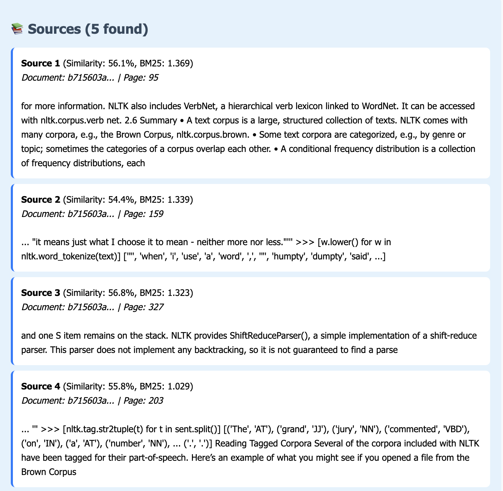
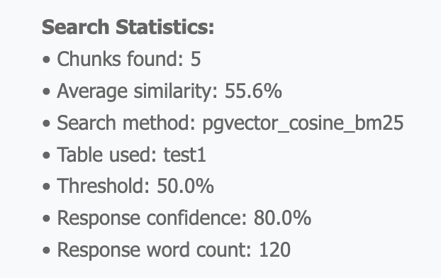
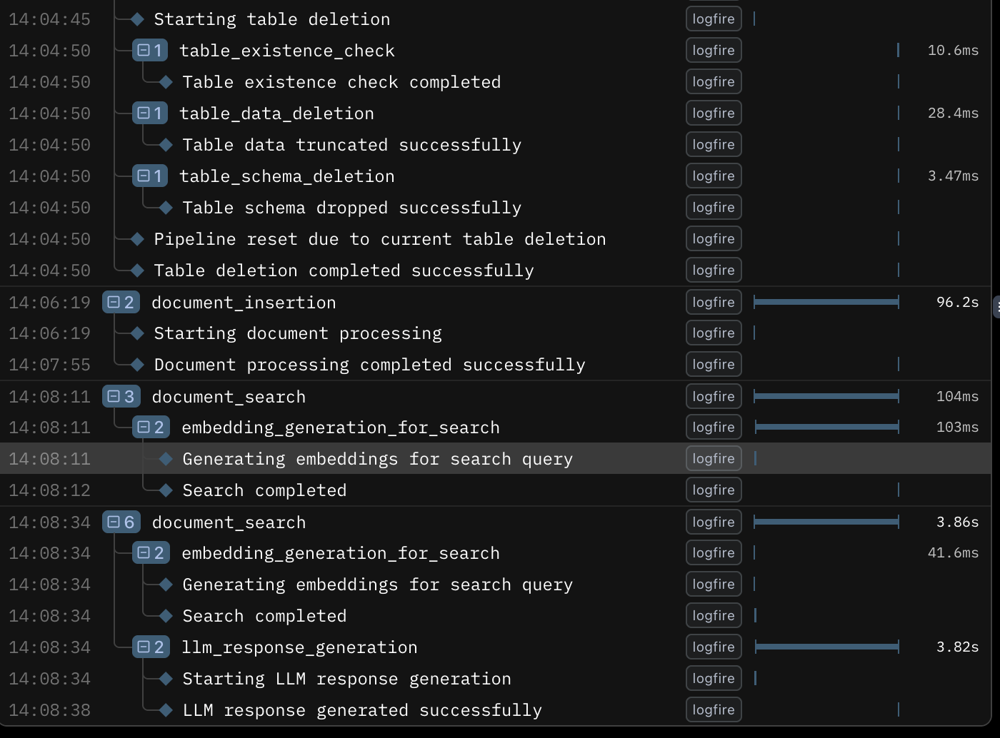
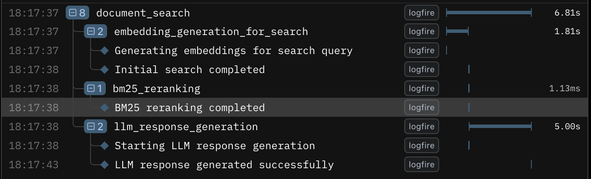

# 🚀 RAG LlamaIndex with pgvector

A production-ready Retrieval-Augmented Generation (RAG) system built with FastAPI, PostgreSQL + pgvector, and Chonkie for semantic chunking.

## 📋 Installation & Setup

### 1. Prerequisites
- Python 3.8+
- PostgreSQL 14+
- Homebrew (for macOS)

### 2. Quick Setup
```bash
# Copy environment template
cp deployment/.env.example deployment/.env

# Edit deployment/.env with your credentials:
POSTGRES_USER=your_username
POSTGRES_PASSWORD=your_password
POSTGRES_DB=rag_db
GOOGLE_API_KEY=your_gemini_api_key

# Run automated setup
bash deployment/setup.sh
```

## 📁 Project Structure

```
rag_llama_index/
├── deployment/                    # Setup & configuration
│   ├── .env.example              # Environment template
│   └── setup.sh                  # Automated setup script
│
├── docs/                         # Sample documents
│   └── llama2.pdf               # Test PDF file
│
├── document_processing/          # Core modules
│   ├── chunk_pdf_with_chonkie.py    # Standalone chunking
│   ├── embed_chunks_to_db.py        # Vector embedding & storage
│   ├── file_validator.py            # File validation
│   ├── full_pipeline_pgvector.py    # Main FastAPI app
│   └── templates.py                 # Web UI templates
│
├── models/                       # Data schemas
│   └── models.py                # Pydantic models
│
└── test/                        # Testing
    └── test_api.py             # API tests
```

## 🔧 Main Components

### `document_processing/chunk_pdf_with_chonkie.py`
**Purpose**: Standalone PDF processing and semantic chunking
- Extracts text from PDF files using PyPDF2
- Performs semantic chunking with Chonkie library
- Supports configurable chunk size and similarity thresholds
- Outputs chunks for inspection

### `document_processing/embed_chunks_to_db.py`
**Purpose**: Vector embedding generation and database storage
- **Classes**:
  - `EmbeddingGenerator`: Creates embeddings using SentenceTransformers
  - `VectorStore`: Manages pgvector database operations
  - `ChunkEmbeddingPipeline`: End-to-end document processing
- **Features**:
  - Batch embedding generation
  - pgvector similarity search
  - Automatic database initialization

### `document_processing/file_validator.py`
**Purpose**: Comprehensive file validation and security
- File existence and size validation (max 50MB)
- Extension checking (.pdf, .txt, .docx)
- File signature verification
- Readability validation

### `document_processing/full_pipeline_pgvector.py`
**Purpose**: Main FastAPI application with web interface


- **Key Endpoints**:
  - `GET /` - Web UI for upload/search
  - `POST /upload` - Document processing
  - `POST /query` - Document search API
  - `GET /stats` - Database statistics
- **Features**:
  - Multi-table support
  - LLM integration (Gemini)
  - Parameter validation
  - Error handling

### `models/models.py`
**Purpose**: Data models and API schemas
- `SupportedFileType` - File type enum
- `FileValidationResult` - Validation response
- `QueryRequest` - Search parameters
- `UploadResponse` - Upload response

## 🚀 Usage

### 1. Start the Application
```bash
cd document_processing
python full_pipeline_pgvector.py
```
Access webUI at: `http://localhost:8000`
Access FastAPI Swagger UI: `http://127.0.0.1:8000/docs`

### 2. Web Interface Usage
1. **Upload Documents**: Select PDF/TXT files, configure chunking parameters
    

2. **Search Documents**: Enter queries, adjust similarity thresholds
    

3. **Search Results**: Show answers and relevant sources + score with rerank
    

     

    

4. **Monitor System**: View stats and health status

    
    

### 3. API Usage Examples

**Upload Document:**
```bash
curl -X POST "http://localhost:8000/upload" \
  -F "file=@document.pdf" \
  -F "chunk_size=512" \
  -F "table_name=documents"
```

**Search Documents:**
```bash
curl -X POST "http://localhost:8000/query" \
  -H "Content-Type: application/json" \
  -d '{"query": "machine learning", "limit": 5}'
```

### 4. Logfire Usage:
- Use Logfire to log steps from end to end
    

- Add Step for logging ReRank if the number of references >= 5
    

## ⚙️ Configuration

### Environment Variables
- `POSTGRES_USER/PASSWORD/DB` - Database credentials
- `GOOGLE_API_KEY` - For Gemini LLM integration
- `DB_HOST/PORT` - Database connection

### Parameters
- **Chunk Size**: 128-2048 tokens (default: 512)
- **Similarity Threshold**: 0.1-0.9 (default: 0.5)
- **Embedding Model**: all-MiniLM-L6-v2 (384 dimensions)

## 🔍 System Features

- **Semantic Chunking**: Intelligent text splitting with Chonkie
- **Vector Search**: High-performance pgvector similarity search
- **Hybrid Retrieval**: Combines vector embeddings with BM25 keyword matching for superior accuracy
- **Reranking Pipeline**: Advanced relevance scoring to surface the most pertinent results
- **File Validation**: Security checks and size limits
- **Multi-table Support**: Organize documents by categories
- **LLM Integration**: Smart responses with Gemini
- **Web Interface**: Modern, responsive UI
- **API Access**: RESTful endpoints for automation
- **Logfire Intergration**: Uisng Logfire for logging and monitoring

## 🛠️ Development Status

✅ **Completed**:
- Chunking and embedding pipeline
- Vector storage with PostgreSQL
- Using BM25 to rerank retrieve documents
- Gemini integration for retrieval
- FastAPI web interface
- Logfire setup
- Organized modular structure

📋 **Todo**:
- Advanced chunking strategies
- Multi-modal document support
- Caching and performance optimization
- Comprehensive testing suite

## 🐛 Troubleshooting

**PostgreSQL Issues:**
```bash
brew services restart postgresql
psql rag_db -c "CREATE EXTENSION vector;"
```

**Port Conflicts:**
```bash
uvicorn full_pipeline_pgvector:app --port 8001
```

**Dependencies:**
```bash
pip install --upgrade -r requirements.txt
```

## ⚠️ Known Issues

### Pydantic AI + Google Gemini `additionalProperties` Warning

**Warning Message:**
```
UserWarning: `additionalProperties` is not supported by Gemini; it will be removed from the tool JSON schema.
```

**What it means:**
- Google's Gemini API doesn't support `additionalProperties` in JSON schemas
- This affects Pydantic models with `dict[str, Any]` or `Dict[str, Any]` fields (like the `metadata` field in `SimpleRAGResponse`)
- Pydantic AI automatically removes these properties and warns you

**Impact on your application:**
- ✅ **Functionality works** - No breaking issues
- ⚠️ **Metadata fields will be empty** when returned from Gemini LLM
- 📝 **Fallback responses still populate metadata** in error scenarios

**Related Models Affected:**
- `SimpleRAGResponse.metadata` field (used for LLM responses)
- Any custom Pydantic models with `dict` type fields

**Status:**
- This is a known limitation of Google's Gemini API
- Pydantic AI team has implemented automatic schema transformation
- Safe to ignore for PoC projects, but consider specific fields instead of generic dicts for production

**More Info:** [Pydantic AI Issue #1469](https://github.com/pydantic/pydantic-ai/issues/1469)