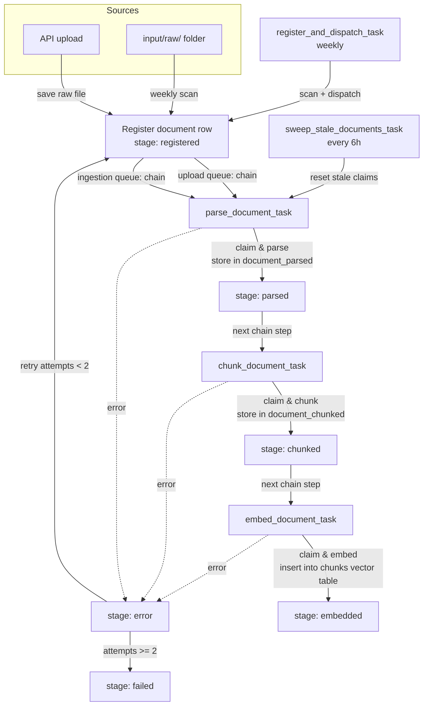
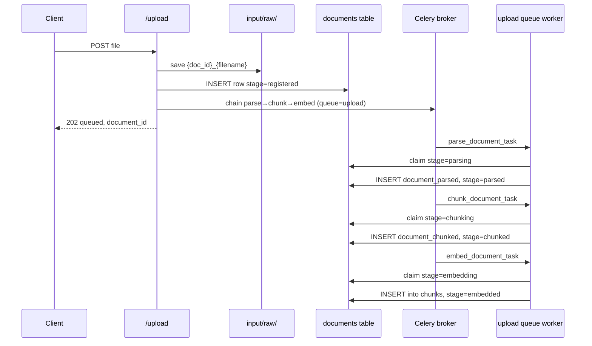

# Ingestion Workflow with Status DB

This document describes the new ingestion architecture introduced to make the pipeline observable and stage-based.

## Overview

Every input file is tracked by one row in the `documents` status table. The pipeline is split into three stages:

1. **Parse** — extract raw text / markdown from the file.
2. **Chunk** — split the parsed text into chunks.
3. **Embed** — generate embeddings and store chunks in the existing `chunks` vector table.

Intermediate artifacts are stored in Postgres:

- `document_parsed` — parsed text and parser metadata.
- `document_chunked` — chunk objects before embedding.

The embedding logic itself is unchanged; it is simply invoked from the last stage.

## Filesystem

- `input/raw/` — original files dropped by the API upload or by the weekly scan.
- `input/markdown/` is no longer used; parsed data lives in `document_parsed`.

## Celery queues

| Queue | Consumers | Purpose |
|---|---|---|
| `upload` | 1 worker | API upload chains: parse → chunk → embed for a single file. |
| `ingestion` | 2 workers (scale with `docker compose up --scale celery_worker_ingestion=2`) | Weekly batch processing: parse, chunk, embed tasks. |
| `rag` | 1 worker | Existing RAG tasks (kept for backward compatibility). |

## Status DB (`documents` table)

```text
id                   -- UUID string, also used as document_id in chunks
file_name            -- unique filename used for POC dedupe
raw_storage_path     -- path to the file in input/raw/
stage                -- registered | parsing | parsed | chunking | chunked | embedding | embedded | error | failed
attempts             -- how many times the file has failed
claimed_at / claimed_by -- worker lease for coordination
parsed_id            -- FK to document_parsed
chunked_id           -- FK to document_chunked
chunk_count          -- number of chunks produced
last_error           -- last exception message
```

## Schedules

- **Weekly** (Sunday 00:00): `register_and_dispatch_task` scans `input/raw/`, registers new files, resets stale claims, retries errored documents, and dispatches processing chains.
- **Every 6 hours**: `sweep_stale_documents_task` resets documents stuck in `parsing`, `chunking`, or `embedding` for longer than `INGESTION_CLAIM_TIMEOUT_MINUTES`.

## Flow diagram



## API upload sequence



## Reprocessing / retry

Because each stage writes its artifact, a failed document can resume from the last successful stage:

- A file in `parsed` will skip parsing and re-run chunk + embed.
- A file in `chunked` will skip parsing and chunking and re-run embed.
- A file in `error` with `attempts < INGESTION_MAX_ATTEMPTS` is reset to `registered` by the weekly scheduler.

## Environment variables

```env
INPUT_RAW_DIR=input/raw
INGESTION_MAX_ATTEMPTS=2
INGESTION_CLAIM_TIMEOUT_MINUTES=30
DEFAULT_CHUNK_SIZE=512
DEFAULT_PARSE_BACKEND=ollama
```

## Notes / future improvements

- Dedupe is currently by `file_name` only. `content_hash` is stored but not used; switch to hash-based dedupe for production.
- The `upload` queue has a single worker, so API uploads are processed one at a time. Batch ingestion uses the `ingestion` queue with two workers.
- Migrations are applied by Postgres initdb on first volume creation. For schema changes during development, recreate the volume with `docker compose down -v`.
